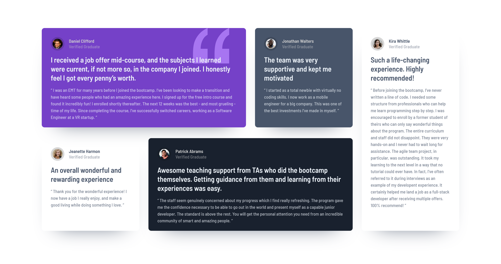

# Testimonials grid section solution

This is a solution to the [Testimonials grid section challenge on Frontend Mentor](https://www.frontendmentor.io/challenges/testimonials-grid-section-Nnw6J7Un7). Frontend Mentor challenges help you improve your coding skills by building realistic projects.

## Table of contents

- [Overview](#overview)
  - [The challenge](#the-challenge)
  - [Screenshot](#screenshot)
  - [Links](#links)
- [My process](#my-process)
  - [Built with](#built-with)
- [Author](#author)

## Overview

### The challenge

Users should be able to:

- View the optimal layout for the site depending on their device's screen size

### Screenshot

### Screenshot

### Links

- Live Site URL: [Testimonials grid section solution](https://sunil-sharma-999.github.io/Testimonials-grid-section-solution/)

## My process

### Built

- Semantic HTML5 markup
- CSS custom properties
- CSS Grid
- CSS Flex
- Mobile-first workflow

## Author

- GitHub - [Sunil Sharma](https://github.com/sunil-sharma-999/)
- Frontend Mentor - [@sunil-sharma-999](https://www.frontendmentor.io/profile/sunil-sharma-999)
- Twitter - [@yourusername](https://www.twitter.com/sharmasunil999)
